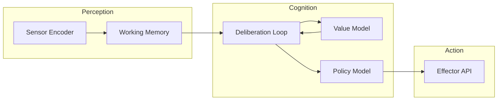

# Cognitive Modules

The NeuraLisp manifesto ultimately targets autonomous cognitive systems that blend differentiable reasoning with symbolic
control.  This primer summarises the planned module graph and links it to the working examples.

## Architectural overview

- **Perception** captures sensory tensors, normalises them, and writes them into working memory.
- **Cognition** evaluates the memory state, queries learned value/policy models, and decides on the next action chunk.
- **Action** publishes the chosen command to the environment interface.

Each box will be implemented as a composition of differentiable primitives plus symbolic glue once the lower-level
libraries stabilise.

## Module responsibilities

| Module | Package prefix | Summary |
|--------|----------------|---------|
| Sensor encoders | `neuralisp.cognition.sensors` | Convert raw environment data into tensors, potentially streaming on GPU |
| Working memory | `neuralisp.cognition.memory` | Maintain differentiable buffers and expose attention-style addressing |
| Deliberation loop | `neuralisp.cognition.control` | Run cognitive cycles that call policy/value networks and symbolic planners |
| Policy model | `neuralisp.cognition.policy` | Choose candidate actions based on latent state |
| Value model | `neuralisp.cognition.value` | Score state-action pairs for planning |
| Effector API | `neuralisp.cognition.effectors` | Send decisions to external processes |

## Example: cognitive loop scaffold

[`examples/cognitive-loop.lisp`](../../examples/cognitive-loop.lisp) demonstrates how these modules stitch together with
mock data today.  The script simulates sensor input, updates a working memory tensor, chooses a symbolic action, and
prints the resulting decision trace.  Although the underlying tensor maths is still manual, the flow mirrors the roadmap
expectations for *Phase 2 – Cognitive Routines*.

Key takeaways from the example:

1. **State normalisation** is performed up front to keep downstream modules agnostic to raw sensor scaling.
2. **Working memory updates** use the tensor helpers to highlight where differentiable attention mechanisms will live.
3. **Loop instrumentation** prints metrics that the future reinforcement-learning stack will optimise.

As new primitives arrive, contributors should extend the example to call the proper packages listed above and document
the changes in [`CHANGELOG.md`](../../CHANGELOG.md) so the research cadence remains transparent.
