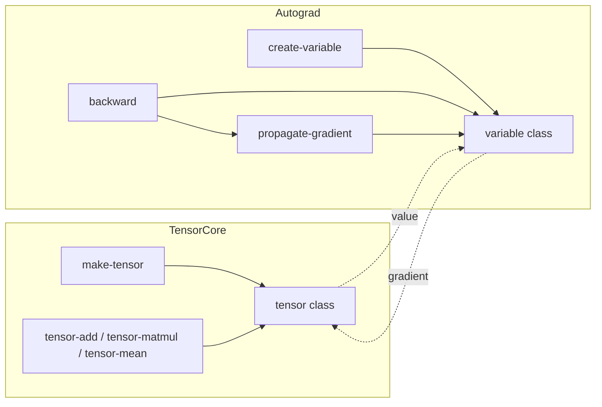

# Tensor & Autograd Internals

NeuraLisp is anchored by two core subsystems: `neuralisp.core.tensor`, which represents numerical state, and
`neuralisp.core.autograd`, which wraps tensors with differentiable bookkeeping.  This document traces how they fit
together.  For the user-facing API see [tensor.md](../tensor.md) and [autograd.md](../autograd.md).

## High-level architecture



Both packages are written in ANSI Common Lisp with no external dependencies, so the system loads and its tests run on a
bare SBCL.  An accelerated backend would slot in behind the operations in `tensor.lisp` without changing these
interfaces.

## Tensor storage model

```common-lisp
(defclass tensor ()
  ((data :initarg :data
         :accessor tensor-data
         :type tensor-storage        ; (simple-array double-float (*))
         :documentation "Flat row-major vector holding the tensor's elements.")
   (shape :initarg :shape
          :accessor tensor-shape
          :type list
          :documentation "List of positive integers describing the tensor's extent.")
   (device :initarg :device :initform :cpu :accessor tensor-device)
   (gpu-pointer :initarg :gpu-pointer :initform nil :accessor tensor-gpu-pointer)))
```

A tensor is a flat row-major `double-float` vector plus an explicit shape, rather than a nested array.  This keeps
indexing arithmetic in one place — `tensor-index` folds subscripts into an offset — and lets every operation work on a
simple vector regardless of rank.

`gpu-pointer` is deliberately untyped.  The previous revision declared it as `cl-cuda.buffer:cublas-device-pointer`,
which meant `tensor.lisp` could not even be *read* on a machine without CUDA installed, despite the GPU module being
documented as optional.

Tensors are built through `make-tensor`, which either fills with a constant or adopts a supplied row-major sequence:

```common-lisp
(make-tensor '(2 3) :initial-element 0.5)
(make-tensor '(2 2) :data '(1 2 3 4))
```

Element type is always `double-float`; inputs are coerced on construction.  Operations return new tensors rather than
mutating their operands.

Shapes must match exactly — there is no broadcasting, and mismatches signal `shape-mismatch` rather than proceeding on
an assumption.  Axis reductions are implemented for rank-2 only, and say so for higher ranks.

## Autograd

```common-lisp
(defclass variable ()
  ((value         :initarg :value         :reader   variable-value :type tensor)
   (gradient      :initarg :gradient      :accessor variable-gradient :type (or null tensor))
   (parents       :initarg :parents       :reader   variable-parents :type list)
   (backward-fn   :initarg :backward-fn   :accessor variable-backward :type (or null function))
   (requires-grad :initarg :requires-grad :reader   variable-requires-grad-p)))
```

`variable` is shadowed in its package: `cl:variable` is an external symbol of `COMMON-LISP` (it is a documentation
type), so defining a class by that name in a package that uses `:cl` is a package-lock violation on SBCL.

Each operation records its operands in `parents` and installs a `backward-fn`.  That makes the graph walkable in
reverse, which is what `backward` does:

```common-lisp
(defun backward (var &optional gradient)
  (let ((*pending-gradients* (make-hash-table :test #'eq)))
    (propagate-gradient var (or gradient (ones-like (variable-value var))))
    (dolist (node (topological-order var) var)
      (let ((node-gradient (gethash node *pending-gradients*)))
        (when node-gradient
          (accumulate-gradient node node-gradient)
          (let ((propagate (variable-backward node)))
            (when propagate
              (funcall propagate node-gradient))))))))
```

Two details carry the correctness of this:

1. **Reverse topological order.**  `topological-order` visits a node's parents before pushing the node itself, so the
   resulting list has every node ahead of everything it was computed from.  A node is therefore only processed once all
   of its consumers have contributed.  Without this, `y = x * x` would deliver half the gradient — the test
   `backward-sums-gradients-arriving-by-several-paths` pins that case.

2. **Per-pass pending gradients.**  In-flight gradients live in `*pending-gradients*`, bound only for the duration of a
   pass, while `variable-gradient` holds the persistent user-visible total.  Keeping these separate is what lets a
   second `backward` start from a clean seed instead of re-propagating whatever the first pass accumulated.  The test
   `backward-accumulates-across-passes-until-zeroed` pins that.

A backward function hands gradients to its operands with `propagate-gradient`, never by writing `variable-gradient`
directly:

```common-lisp
(defun variable-multiply (var-a var-b)
  (make-op-variable (tensor-multiply (variable-value var-a) (variable-value var-b))
                    (list var-a var-b)
                    (lambda (gradient)
                      (propagate-gradient var-a (tensor-multiply gradient (variable-value var-b)))
                      (propagate-gradient var-b (tensor-multiply gradient (variable-value var-a))))))
```

Gradients accumulate across passes, matching the usual training-loop convention; `zero-gradient` clears them.

## Planned evolution

1. **More differentiable operations.**  Only `variable-add` and `variable-multiply` are differentiable today.  Matrix
   multiply, activations, and losses come next; each needs a forward value, its operands as parents, and a backward
   function calling `propagate-gradient`.
2. **Broadcasting.**  Elementwise operations currently require identical shapes.  Broadcast-aware operations need a
   matching gradient reduction step so a broadcast operand receives the summed gradient.
3. **An accelerated backend.**  `tensor-matmul` is a naive triple loop.  Dispatching to BLAS or magicl behind the
   current entry points is the obvious next step once there is a workload to justify it.

These are tracked in the roadmap under *Phase 1 – Differentiable Primitives*.
