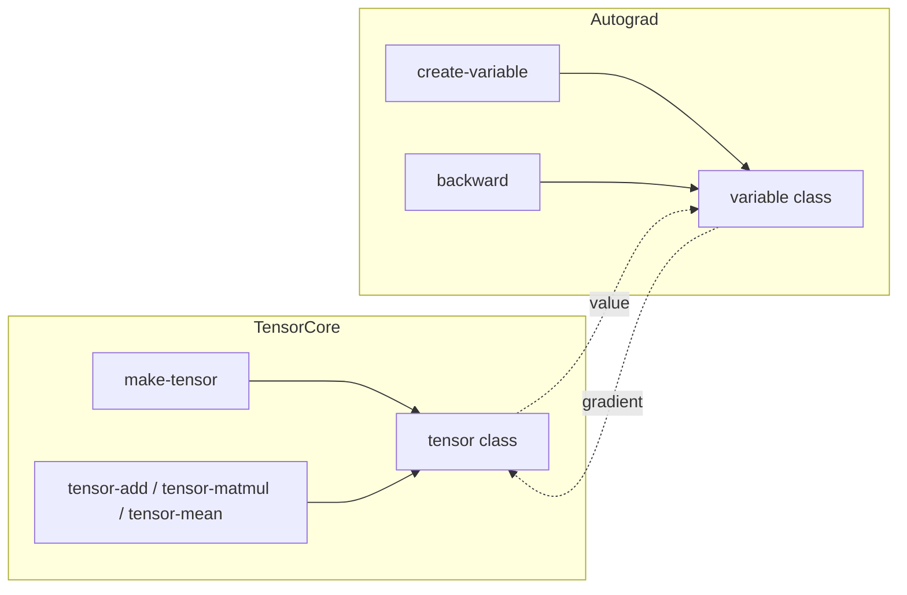

# Tensor & Autograd Internals

NeuraLisp is presently anchored by two core subsystems: `neuralisp.core.tensor`, which represents numerical state, and
`neuralisp.core.autograd`, which wraps tensors with differentiable bookkeeping.  This document traces how both modules
fit together and how the future gradient pipeline will mature.

## High-level architecture



The tensor package constructs numerical containers and delegates heavy lifting to [`magicl`](https://github.com/quil-lang/magicl).
The autograd package wraps those tensors with metadata required to propagate gradients once the operation registry is
complete.

## Tensor storage model

```common-lisp
(defclass tensor ()
  ((data :initarg :data
         :accessor tensor-data
         :type magicl:matrix
         :documentation "N-dimensional array holding the tensor's data.")
   (shape :initarg :shape
          :accessor tensor-shape
          :type list
          :documentation "List of integers representing the tensor's shape.")
   (gpu-pointer :initform nil
                :accessor tensor-gpu-pointer
                :type (or null cl-cuda.buffer:cublas-device-pointer)
                :documentation "Pointer to tensor's data on GPU memory.")))
```

The `tensor` class couples a `magicl:matrix` with auxiliary state.  During early development the GPU pointer is a stub,
allowing the `tensor` API to be exercised without CUDA present.

Tensors are normally built through `make-tensor`, which allocates a constant matrix and optionally migrates it to the
GPU hook:

```common-lisp
(defun make-tensor (shape &key (initial-element 0) (on-gpu nil))
  (let ((tensor (make-instance 'tensor
                               :data (magicl:const initial-element shape :layout :row-major)
                               :shape shape)))
    (when on-gpu
      (move-to-gpu tensor))
    tensor))
```

Higher-level operations (`tensor-add`, `tensor-matmul`, `tensor-sum`, etc.) return new tensor instances by copying the
underlying `magicl` matrix.  Broadcasting is currently manual; the helper assumes shapes are compatible, making it clear
where future validation hooks must be inserted.

## Autograd scaffolding

Automatic differentiation is managed by the `variable` class:

```common-lisp
(defclass variable ()
  ((value :initarg :value
          :reader variable-value
          :type tensor
          :documentation "The tensor object representing the value of the variable.")
   (gradient :initarg :gradient
             :accessor variable-gradient
             :type (or null tensor)
             :documentation "The tensor object representing the gradient of the variable.")
   (backward :initarg :backward
             :accessor variable-backward
             :type (or null function)
             :documentation "The backward function for computing gradients.")))
```

`create-variable` couples a tensor value with an optional gradient buffer.  Backward propagation is currently a manual
hook: if a node has a `backward` function it will be invoked with the incoming gradient.  This makes it easy to prototype
custom differentiable primitives while the standard layer library is still under construction.

```common-lisp
(defun backward (var &optional (grad-output 1.0))
  (when (functionp (variable-backward var))
    (funcall (variable-backward var) grad-output)))
```

`partial-grad` and `apply-partial-grad` demonstrate how the chain rule will thread through connected variables.  The
placeholders purposely expose the intermediate state so that contributors can iterate on a full computational graph
engine during the "Differentiable Primitives" phase of the roadmap.

## Planned evolution

The current module layout supports two short-term enhancements:

1. **Tensor data adapters.**  Introduce constructor helpers that accept row-major lists and perform broadcast-safe shape
   inference before handing control to `magicl`.  This will simplify dataset ingestion and reduce the amount of manual
   bookkeeping in the examples.
2. **Autograd operation registry.**  Extend the `variable` type with references to forward operation nodes.  Each tensor
   primitive will register a matching backward lambda, enabling automatic gradient propagation across composed graphs.

These improvements are tracked in the roadmap under *Phase 1 – Differentiable Primitives* and will unlock the optimiser
and layer libraries that are currently stubbed out in `src/`.
