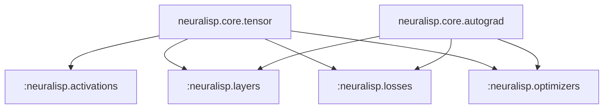
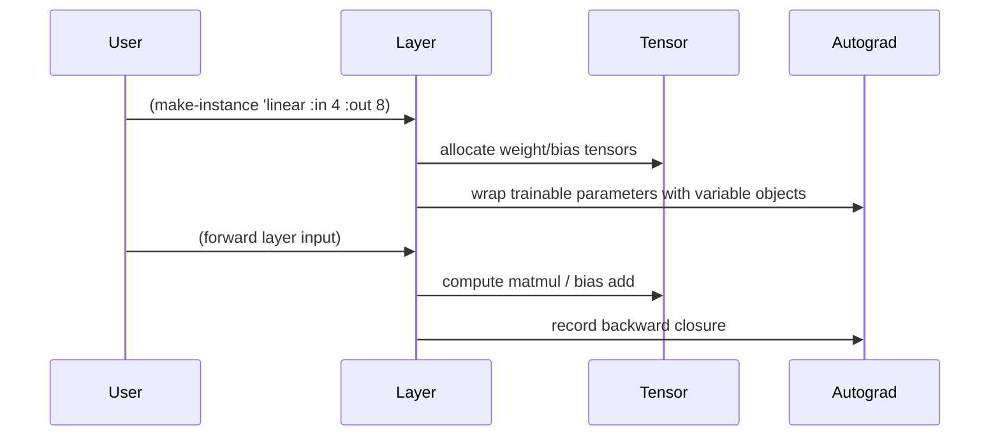

# Neural Primitives

This reference tracks the differentiable building blocks that NeuraLisp exposes today and the ones scheduled for the
next manifesto phase.  The primitives fall into three families: activations, parametric layers, and optimisation
operators.

## Current surface

Even though many source files are still skeletal, the repository establishes the public packages that the final
implementations will live in.  Contributors can load the stubs to experiment with API shapes while the core tensor and
autograd layers are stabilised.

The diagram highlights the dependency direction: all primitives flow through the tensor core, while the trainable
components also depend on autograd metadata.

## Activation functions

`src/activations/` currently defines package scaffolding for the standard set of nonlinearities (ReLU, Sigmoid, Tanh).
The files will eventually define generic methods that accept `variable` instances and register their backward passes.
During *Phase 1 – Differentiable Primitives* the following checklist will guide implementation:

- [ ] Define a `defgeneric`/`defmethod` pair for each activation that accepts tensors and returns variables.
- [ ] Register backward lambdas that compose with `partial-grad`.
- [ ] Provide numerical stability tests that exercise CPU and GPU tensors.

## Linear and convolutional layers

Layer files under `src/layers/` are intentionally empty so that the community can agree on constructor signatures before
hardening the implementation.  The proposed flow is illustrated below.

## Loss functions and optimisers

Loss modules (`src/losses/`) will consume predictions and targets, producing scalar variables whose gradients backpropagate
through the model graph.  Optimisers (`src/optimizers/`) will own the parameter update rules.  Both modules depend on the
core tensor math plus future broadcasting utilities outlined in the internals document.

### Planned components

| Primitive | Status | Notes |
|-----------|--------|-------|
| Mean-squared error | Prototype signature present | Implementation pending better tensor broadcasting |
| Cross-entropy | Prototype signature present | Requires numerically stable `log-softmax` helper |
| SGD | Header stub | Needs parameter iteration helpers |
| Adam | Header stub | Depends on per-parameter moment buffers |

## Working with the stubs today

Until the primitives are fully implemented, examples rely on manual tensor composition to showcase the intended usage
pattern.  The comments in [`examples/simple-mlp.lisp`](../../examples/simple-mlp.lisp) describe how to migrate the
hand-rolled computations into layer abstractions once the library fills in.

Contributors experimenting with new primitives should link their work to the roadmap items in [`ROADMAP.md`](../../ROADMAP.md)
so that the phase progression remains visible to downstream users.
